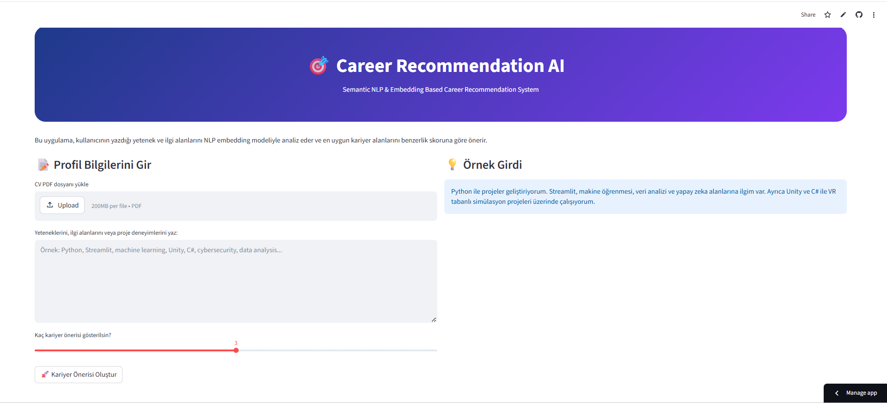
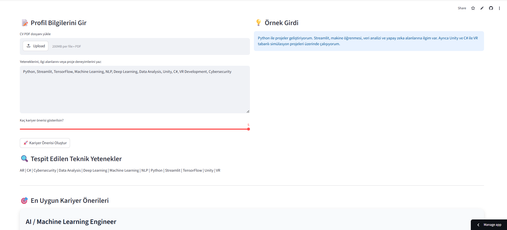
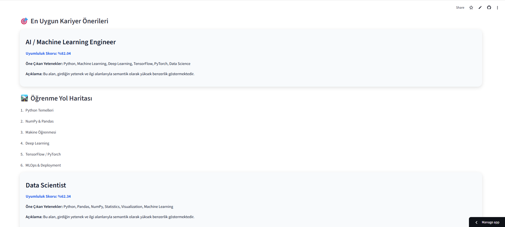
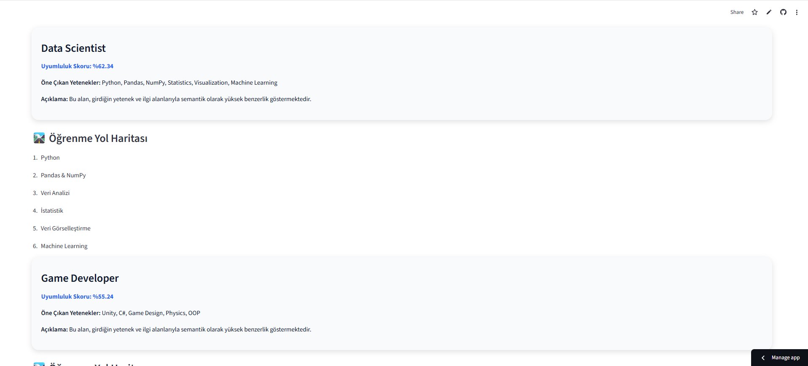
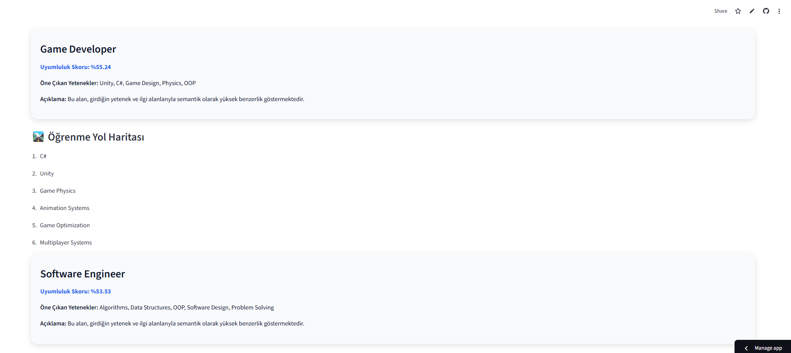
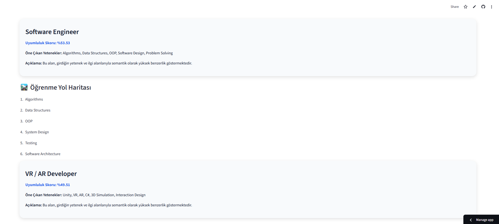
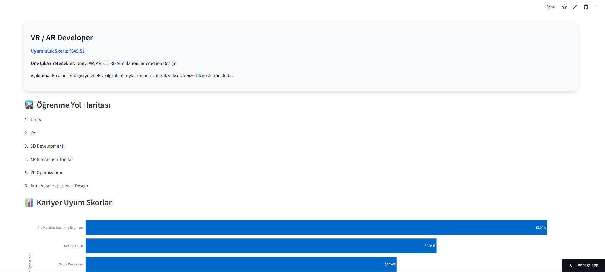
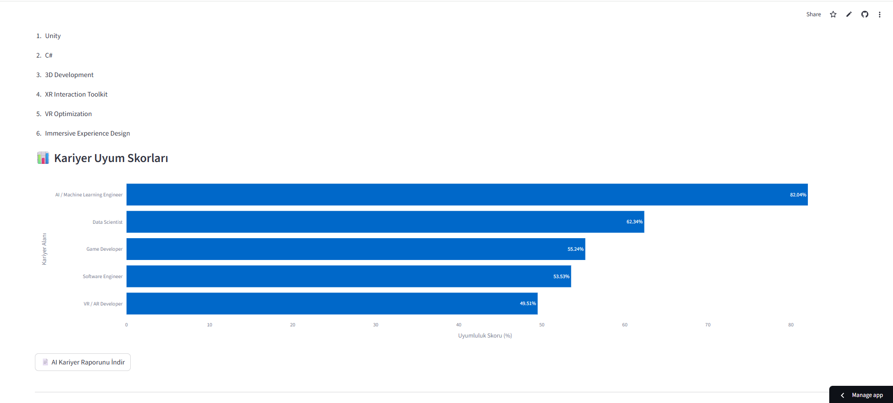

<div align="center">

# 🎯 Career Recommendation AI



### Semantic NLP & Embedding Based Career Recommendation System

An AI-powered career recommendation platform that analyzes user skills, interests, project experience, and CV content using NLP embedding models to recommend the most suitable technology career paths.

<br>

🚀 **Live Demo**  
https://career-recommendation-ai.streamlit.app/

<br>


</div>

---

# 📌 Project Overview

Career Recommendation AI is an intelligent career guidance platform developed using **Natural Language Processing (NLP)** and **semantic embedding models**.

The system analyzes:

- Technical skills
- User interests
- Project experience
- CV / Resume content
- Technology keywords

and recommends the most suitable software and technology career paths based on semantic similarity scores.

The platform also generates:

- 📊 Career compatibility charts
- 🧠 Technical skill analysis
- 🛣️ Personalized learning roadmaps
- 📄 AI-generated PDF career reports

---

# 🚀 Features

✅ NLP-based semantic career recommendation system  
✅ CV / Resume PDF analysis  
✅ Automatic technical skill extraction  
✅ AI-powered similarity scoring  
✅ Interactive Streamlit dashboard  
✅ Career compatibility visualization with Plotly  
✅ Personalized learning roadmaps  
✅ Downloadable AI career report (PDF)  
✅ Modern responsive UI design  
✅ Semantic embedding-based recommendation engine  

---

# 🧠 Technologies Used

| Technology | Purpose |
|---|---|
| Python | Core backend development |
| Streamlit | Interactive web application |
| Sentence Transformers | NLP embedding model |
| Scikit-learn | Cosine similarity calculations |
| Plotly | Data visualization |
| PyPDF | CV PDF parsing |
| ReportLab | PDF report generation |
| Pandas | Data processing |

---

# 🖥️ Application Screenshots

---


## 🔍 Technical Skill Detection



---

## 🤖 AI / Machine Learning Engineer Recommendation



---

## 📊 Data Scientist Recommendation



---

## 🎮 Game Developer Recommendation



---

## 💻 Software Engineer Recommendation



---

## 🥽 VR / AR Developer Recommendation



---

## 📈 Career Compatibility Scores



---

# ⚙️ How It Works

```text
User Input / CV Upload
            ↓
Skill Extraction & NLP Analysis
            ↓
Sentence Embedding Generation
            ↓
Cosine Similarity Calculation
            ↓
Career Compatibility Ranking
            ↓
Learning Roadmap & PDF Report
```

---

# 🛣️ Supported Career Paths

The system currently supports:

- AI / Machine Learning Engineer
- Data Scientist
- Backend Developer
- Frontend Developer
- Cybersecurity Specialist
- Game Developer
- VR / AR Developer
- Software Engineer

---

# 📂 Project Structure

```bash
career-recommendation-ai/
│
├── images/
│   ├── main_interface.png
│   ├── skill_detection.png
│   ├── ai_engineer_result.png
│   ├── data_scientist_result.png
│   ├── game_developer_result.png
│   ├── software_engineer_result.png
│   ├── vr_ar_result.png
│   └── career_chart.png
│
├── app.py
├── requirements.txt
└── README.md
```

---

# ▶️ Run Locally

## 1️⃣ Clone the Repository

```bash
git clone https://github.com/ikrabaser/career-recommendation-ai.git
```

---

## 2️⃣ Navigate to Project Directory

```bash
cd career-recommendation-ai
```

---

## 3️⃣ Install Dependencies

```bash
pip install -r requirements.txt
```

---

## 4️⃣ Run Streamlit App

```bash
streamlit run app.py
```

---

# 📄 Example Input

```text
Python ile projeler geliştiriyorum.
Machine learning, NLP, Streamlit, veri analizi ve yapay zeka alanlarına ilgim var.
Ayrıca Unity ve C# ile VR tabanlı simülasyon projeleri geliştiriyorum.
```

---

# 📈 AI Recommendation Logic

The recommendation engine works with:

- Semantic NLP embeddings
- Sentence similarity analysis
- Technical keyword extraction
- Cosine similarity ranking

This allows the system to recommend careers not only through exact keyword matching but also through contextual semantic understanding.

---

# 🎯 Future Improvements

- Real-time AI chatbot assistant
- LLM integration
- Advanced CV parsing
- Personalized course recommendations
- Multi-language support
- AI interview preparation system
- User authentication system
- Career analytics dashboard

---

# 👩‍💻 Developer

## Leyla İkra Başer

Computer Engineering Student  
AI • NLP • VR/AR • Machine Learning • Cybersecurity

GitHub:  
https://github.com/ikrabaser

